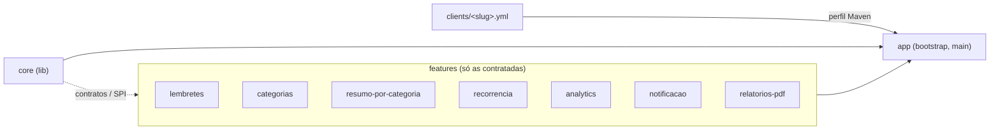
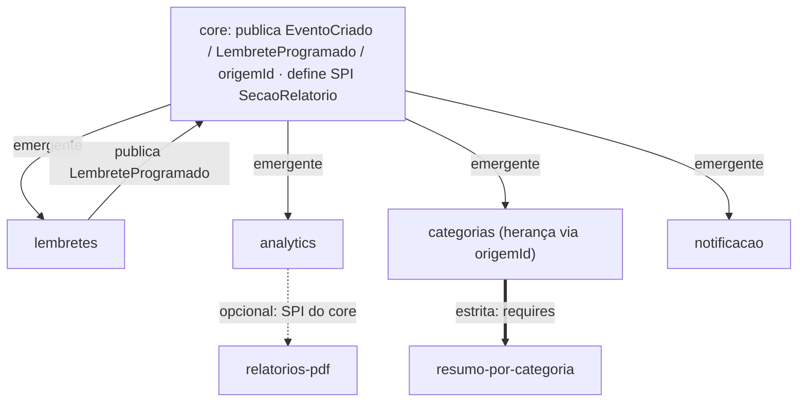

# LPsoft

Projeto-exemplo de **Linha de Produto de Software (LPS)** em Java + Next.js.

Uma **única base de código** entrega produtos diferentes por cliente — cada cliente recebe só as funcionalidades que contratou, com um pacote de entrega próprio — usando apenas mecanismos **nativos do stack**: Maven multi-module, classpath scanning do Spring, Flyway multi-location, um registry de slots no frontend e um script de empacotamento. Sem framework de "plugins", sem feature flags espalhadas pelo código, sem rede entre módulos.

> A tese: dá para ter módulos isolados, dependências explícitas entre eles e corte por cliente — os ganhos que se busca em microserviços — resolvidos em **tempo de montagem**, dentro de um monólito modular. O `build.sh` *prova* isso: falha quando uma dependência obrigatória não é contratada e degrada graciosamente quando uma opcional falta.

## Stack

- **Backend:** Spring Boot 3.3 · Java 21 · Maven multi-module
- **Frontend:** Next.js 16 · TypeScript 5 · Tailwind CSS · TanStack Query
- **Banco:** PostgreSQL 16
- **Migrations:** Flyway — multi-location, versão por timestamp `YYYYMMDDHHMMSS`
- **Container:** Docker + Docker Compose
- **CI/CD:** GitHub Actions + GHCR — *roadmap (ainda não implementado)*

## Conceito de LPS

| Conceito | No LPsoft |
|---|---|
| **Core** | A plataforma comum: domínio (`Usuario`, `Evento`), auth JWT, contratos de evento, pontos de extensão (SPI). Não conhece nenhuma feature. |
| **Feature** | Módulo **opcional**, contratável por cliente. Depende só do core (e, quando declarado, de outra feature). |
| **Cliente** | Um manifesto `clients/<slug>.yml` — **fonte única**: quais features, portas, banco. "Contratar uma feature" = uma flag `true`. |
| **Montagem** | O perfil Maven (backend) e o composition root (frontend) materializam o manifesto. O que não foi contratado **não existe** no artefato daquele cliente. |

Três clientes de exemplo:

- **`lite`** — só o core, zero features.
- **`plus`** — tudo, **menos** `analytics` (prova a dependência opcional).
- **`enterprise`** — todas as features.

## Estrutura do repositório

```
LPsoft/
├── backend/
│   ├── core/                 # biblioteca: domínio, auth, contratos, SPI — NÃO executável
│   ├── app/                  # bootstrap (tem o main; agrega core + features por perfil)
│   └── features/
│       ├── lembretes/        # política de antecedência (tela própria) + contrato do core
│       ├── categorias/       # feature autônoma (dados + rotas + UI + badge)
│       ├── resumo-por-categoria/  # depende ESTRITAMENTE de categorias (requires)
│       ├── recorrencia/      # estende o core gerando eventos
│       ├── analytics/        # onividente — escuta tudo, agrega
│       ├── notificacao/      # canal de aviso (emergente via contrato do core)
│       └── relatorios-pdf/   # PDF sem libs (dependência opcional via SPI)
├── frontend/
│   └── src/
│       ├── core/             # auth, eventos, calendário, registry de slots
│       ├── features/         # espelha o backend (cortado por cliente)
│       └── app/(protected)/  # rotas (guard hasFeature)
├── clients/                  # lite.yml · plus.yml · enterprise.yml (fonte única)
├── scripts/build.sh          # empacota dist/<cliente>/ (binary | source | image)
└── docker-compose.yml        # perfis dev / prod
```

> `core` é **biblioteca**, não roda sozinho (não tem `main`). Quem executa é o
> `app`, que agrega `core` + as features do perfil. Por isso todo comando de
> backend usa `-pl app -am` (build o `app` e seus módulos dependentes).

## Arquitetura — backend

Multi-module Maven. **Dois eixos independentes** no comando:

| Parâmetro | Controla | Regra |
|---|---|---|
| `-P <perfil>` | **Quais features** entram no build | sem `-P` → perfil `dev` = **todas** (conveniência de dev); `-P lite` = **nenhuma**; `-P plus` / `-P enterprise` = conforme o cliente |
| `-pl app -am` | **O que executar/empacotar** | `app` é o único módulo com `main`; `-am` builda `core` (+features do perfil) antes |

`-P` escolhe *o que tem dentro*; `-pl app -am` escolhe *o que ligar*.

> **Como o perfil se liga ao manifesto:** hoje o perfil Maven (`backend/pom.xml` + `backend/app/pom.xml`) e o `clients/<slug>.yml` são casados **por convenção (mesmo nome) e mantidos em sincronia manualmente** — o perfil não é gerado. O `build.sh` consome o manifesto para o corte do frontend e a validação do grafo de dependências; para o backend ele apenas invoca `mvn -P <slug>`. Gerar os perfis a partir do manifesto é roadmap.

**Descoberta automática (sem registro manual):**

- `@SpringBootApplication(scanBasePackages = "io.lpsoft")` + `@EntityScan` +
  `@EnableJpaRepositories` em `io.lpsoft` → toda feature presente no classpath
  é descoberta. Feature fora do build = invisível, sem nenhuma linha de
  configuração condicional.
- **Flyway multi-location:** cada feature registra um
  `FlywayConfigurationCustomizer` que *anexa* sua location. O bean só existe se
  o módulo está no classpath → a migration da feature só roda se ela foi
  contratada. Sem feature, sem tabela.
- Trocar de perfil exige `mvn clean` (artefato de um build anterior contamina).



## Arquitetura — frontend

Espelha o backend:

- **Dev / build completo tem todas as features.** `hasFeature()` (lê
  `NEXT_PUBLIC_FEATURES`, exposto pelo manifesto) controla **menu e rota** em
  runtime — rota não contratada cai em `notFound()` (404).
- **O corte físico real é do `build.sh`**: antes do `next build` ele remove
  `src/features/<não-contratada>`, a rota correspondente e a linha dela no
  composition root. O bundle do cliente não carrega o código não contratado.
  *(Não se usa alias de bundler — Turbopack resolve os path-aliases do tsconfig
  com precedência; o corte é por remoção física, espelhando o Maven.)*

**Registry de slots = injeção de dependência análoga ao SPI do backend:**

- `src/core/shared/slots.ts` — o core define as "tomadas":
  `EventoRowSlot` (linha do evento), `EventoCreateSlot` (formulário de
  criação, read-write), `EventoBadgeSlot` (etiqueta read-only no calendário).
- `src/core/shared/features.ts` — **composition root**: importa o `register`
  das features contratadas. É o análogo ao *component scan* do Spring; o
  conjunto de imports é o "classpath", e o `build.sh` remove a linha de uma
  feature não contratada (espelha o perfil Maven).
- A feature se registra (`features/<x>/register.ts` →
  `registerEventoRowSlot(...)` etc.). O **core nunca importa uma feature** —
  só lê o registry; lista vazia ⇒ nada renderiza. Mesmo princípio do
  `List<SecaoRelatorio>` injetado no backend.

## Domínio

Mini-agenda compartilhada — substrato simples para demonstrar os mecanismos de
LPS sem ruído de regra de negócio.

- Entidades: `Usuario`, `Evento` (com `origem_id` — raiz da qual o evento
  deriva; soft-reference informal, sem FK física).
- Core: cadastro, login (JWT), CRUD de evento, **calendário mensal** (view
  padrão, navegação por mês, clicar no dia cria com data/horário sugerido,
  clicar no evento abre modal de edição/exclusão).

## Catálogo de features

Cada feature existe para provar um padrão de composição:

| Feature | Padrão | Backend | Frontend |
|---|---|---|---|
| `lembretes` | **Política visível**: reage a `EventoCriado` e decide *quando* avisar (antecedência configurável); publica o contrato do core `LembreteProgramado` | listener + política + REST | página (política + lista de programados) |
| `categorias` | **Autônoma**: dados, migration, rotas e UI próprios; referencia `evento` por FK informal | tabelas + REST | página + slots (linha, criação, badge no calendário) |
| `resumo-por-categoria` | **Dependência estrita**: importa os tipos de `categorias` e conta eventos por categoria — não compila sem ela | `requires: [categorias]` | painel injetado em `/categorias` via slot do core (não tem rota própria) |
| `recorrencia` | **Estende o core**: gera novos eventos a partir de um modelo; janela + "até"; job de reposição | regra + `EventoService.criar` | página + slot de criação |
| `analytics` | **Onividente**: escuta o contrato do core e agrega; implementa o SPI de relatório | agregação + endpoint | dashboard |
| `notificacao` | **Canal emergente**: reage ao contrato do core `LembreteProgramado` (zero dep entre features); dispatcher agendado marca como enviada na hora | listener + dispatcher (`@Scheduled`) | página (programada → enviada) |
| `relatorios-pdf` | Gera PDF (sem libs externas); **dependência opcional** de `analytics` via SPI | `integrates-with: [analytics]` | página com prévia do conteúdo + download |

No `lite` nenhuma aparece (rota 404, sem tabela, sem link). No `enterprise`
todas. No `plus`, tudo menos `analytics` — e o PDF sai sem a seção de
agregados, sem quebrar.

## Desacoplamento — os três tipos de relação



**1. Emergente — via contrato do core.** O core publica fatos
(`EventoCriado`, e `origemId` quando um evento deriva de outro). Features
reagem sem se conhecer: `lembretes` agenda, `analytics` conta, `categorias`
herda as categorias do modelo. Ninguém importa ninguém — só o contrato do core.
A própria `lembretes` publica outro contrato do core (`LembreteProgramado`);
`notificacao` reage a ele e dispara o aviso na hora — mesmo padrão, segundo salto.

**2. Estrita — `requires`.** A feature **não compila** sem a dependência:
dependência Maven no módulo da outra + import do contrato dela.
`feature-deps.yml` declara `requires: [...]`. O `build.sh` **falha (exit 1)**
se um cliente contratar a feature sem a dependência. Exemplo real:
`resumo-por-categoria` importa os tipos de `categorias` (`Categoria`,
`EventoCategoriaRepository`) e declara `requires: [categorias]` — um resumo
*por categoria* não existe sem o conceito de categoria.

**3. Opcional — `integrates-with`.** Zero acoplamento Maven entre as features.
A integração passa por um **ponto de extensão do core**
(`io.lpsoft.core.shared.spi.SecaoRelatorio`): `analytics` opcionalmente o
implementa; `relatorios-pdf` injeta `List<SecaoRelatorio>` (vazia se ausente).
Sem `analytics`, o PDF sai sem a seção — **builda e roda**, só degrada.

| | Emergente | Estrita (`requires`) | Opcional (`integrates-with`) |
|---|---|---|---|
| Acoplamento | nenhum (via core) | compile-time (dep Maven + import) | nenhum entre features (via SPI do core) |
| Conhece a outra? | não | sim (contrato dela) | não (só o SPI do core) |
| Sem a outra | não reage | **build falha** (exit 1) | builda, roda, **degrada** |
| Mediador | core (contrato) | a própria feature dependida | core (SPI) |

## Rodando local (desenvolvimento)

Requisitos: Java 21, Node 20+, Docker + Compose.

```bash
# 1. Banco (Postgres em :5482)
docker compose --profile dev up -d db-dev

# 2. Backend (pasta backend/) — todas as features (perfil dev default)
./mvnw -pl app -am spring-boot:run            # API em http://localhost:8130/api/v1

# 3. Frontend (pasta frontend/)
npm run dev                                   # http://localhost:3050
```

**Rodar exatamente como um cliente recebe:**

```bash
# Backend
./mvnw -pl app -am spring-boot:run            # tudo (default dev)
./mvnw -P lite       -pl app -am spring-boot:run   # zero features
./mvnw -P plus       -pl app -am spring-boot:run   # tudo menos analytics
./mvnw -P enterprise -pl app -am spring-boot:run   # todas

# Frontend (espelha via CLIENT)
CLIENT=lite npm run dev
CLIENT=enterprise npm run dev
```

> Você **nunca** é obrigado a carregar tudo: sem `-P` o `dev` traz todas por conveniência; use `-P lite` para trabalhar/testar o que um cliente enxuto realmente recebe.

Build empacotado direto pelo Maven (sem o `build.sh`):

```bash
./mvnw -P enterprise -pl app -am clean package    # backend/app/target/lpsoft.jar
java -jar backend/app/target/lpsoft.jar
docker compose --profile prod up -d --build       # stack containerizada
```

### Portas

| | dev (compose) | prod (compose) | lite | plus | enterprise |
|---|---|---|---|---|---|
| Backend  | 8130 | 8131 | 8132 | 8134 | 8133 |
| Frontend | 3050 | 3051 | 3052 | 3054 | 3053 |
| Postgres | 5482 | 5483 | 5484 | 5486 | 5485 |

(Portas por cliente vêm do respectivo `clients/<slug>.yml`; rodam lado a lado
sem colisão.)

## Empacotamento por cliente — `scripts/build.sh`

```bash
scripts/build.sh <cliente> [--mode=binary|source|image]
```

Lê `clients/<cliente>.yml`, **valida o grafo de dependências** (`feature-deps.yml`: `requires` faltando → erro/exit 1; `integrates-with` é informativo), corta o frontend fisicamente (com restauração via `trap`, não suja a worktree) e produz `dist/<cliente>/`.

| Modo | O que entrega |
|---|---|
| `binary` (default) | `mvn -P <cliente> clean package` + Next standalone → JAR + frontend + `docker-compose.yml` + `.env` |
| `source` | Código-fonte **já filtrado** + **POM enxuto** (só core+app+features contratadas, sem profiles) + compose; builda no `up --build` |
| `image` | Só o `docker-compose.yml` apontando para imagens publicadas (GHCR) |

Princípios:

- **O manifesto é input interno da tooling — nenhum modo o entrega.** As decisões são *projetadas* no artefato (perfil/POM, env, compose).
- Containers nomeados `lpsoft-<servico>-<cliente>` (rodam lado a lado).
- `mvn clean` por cliente (artefato stale contamina).

Provar a guarda de dependência estrita — um cliente que contrate
`resumo-por-categoria` sem `categorias` é recusado antes de qualquer build:

```text
$ scripts/build.sh <cliente-invalido>
>> Validando dependências de '<cliente-invalido>' (features: resumo-por-categoria)
  ✗ feature 'resumo-por-categoria' requer 'categorias', que não está contratada
ERRO: grafo de dependências inválido para '<cliente-invalido>'   → exit 1
```

Provar a degradação da opcional:

```bash
scripts/build.sh enterprise   # PDF inclui a seção de Analytics
scripts/build.sh plus         # mesmo PDF, sem a seção — sem erro
```

## Roadmap

- CI/CD: GitHub Actions (build por matriz de clientes) + publicação no GHCR.
- Testes E2E (Playwright) cobrindo os fluxos por cliente.
